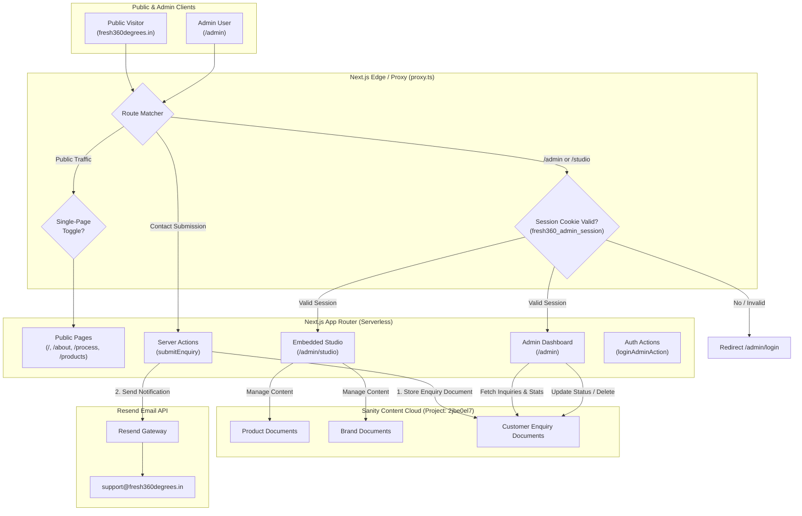

# Fresh 360 — Stack & Architecture Documentation

This document outlines the production architecture, technology stack, data flow, security model, and external integration configuration for the **Fresh 360 Degrees Foods LLP** platform.

---

## 1. System Architecture Overview

The system is built on a serverless, decoupled modern architecture without requiring external database instances (such as PostgreSQL, MySQL, Redis, Firebase, or an Oracle VPS). All state is maintained between **Next.js App Router (Vercel)** and **Sanity CMS**.



---

## 2. Technology Stack

| Layer | Technology | Details / Role |
| :--- | :--- | :--- |
| **Framework** | Next.js 16.2.4 (App Router) | Server components, server actions, route handlers, Turbopack |
| **UI Library** | React 19.2.4 + Tailwind CSS v4 | Component architecture with modern utility styling |
| **Animations** | Motion 12 (Framer Motion) | Micro-interactions, frosted glass navbars, page transitions |
| **Content Management** | Sanity Studio v5 (`next-sanity` v12) | Content lake for products, brands, and customer inquiries |
| **Icons & Media** | Lucide React + Vector SVG Assets | Official Fresh 360 SVG branding assets |
| **Form Validation** | Zod 3.25 | Server & client-side schema parsing and data hygiene |
| **Email Delivery** | Resend 4.1 | Transactional notifications to `support@fresh360degrees.in` |
| **Authentication** | Web Crypto HMAC-SHA256 | HttpOnly cookie-based session with timing-safe validation |

---

## 3. Branding & Visual Identity

1. **Official Brand Logo**:
   - Master asset: `public/fresh360-logo.svg`
   - Component: `components/shared/Logo.tsx` utilizing exact vector path coordinates (`components/shared/logoPaths.ts`).
   - Supports `light`, `dark` (for dark footer backgrounds), and `auto` variants without raster artifacts.
   - All site logos link directly to `/`.
2. **Official Cropped Favicon**:
   - Favicon asset: `public/favicon.svg` and `app/icon.svg`.
   - Cropped precisely to the Fresh 360 leaf emblem and orbital arcs (`viewBox="281 297 512 512"`).
3. **Official Social Link**:
   - Official Instagram URL: `https://www.instagram.com/fresh360degreesfoods`.

---

## 4. Operational Inquiries Pipeline

### Lead Capture Lifecycle
When a visitor completes the inquiry form on `/contact` or the home page:
1. **Validation & Normalization**:
   - The form fields (`fullName`, `email`, `phone`, `brandInterest`, `inquiryType`, `message`) are validated server-side using Zod.
   - Mobile numbers are normalized and sanitized.
2. **Primary Storage in Sanity CMS**:
   - A document of type `inquiry` is immediately created in Sanity CMS dataset `production`.
   - Schema fields captured:
     - `fullName`: String (Required)
     - `email`: String (Required, validated email format)
     - `phone`: String (Optional, validated mobile format)
     - `brandInterest`: String ('Juicera' | 'Fruizy' | 'Both' | 'General')
     - `inquiryType`: String ('Partnership Inquiry' | 'Bulk/Business Order' | 'Franchise Opportunity' | 'Feedback' | 'Other')
     - `message`: Text (Required)
     - `status`: String ('new' | 'contacted' | 'resolved', defaults to 'new')
     - `submittedAt`: Datetime (ISO 8601 string)
     - `internalNotes`: Text (Private operational staff notes)
   - **Lead Preservation Guarantee**: Storage in Sanity occurs *before* any external email calls. If email dispatch fails or Resend domain verification is pending, the customer inquiry is permanently saved.
3. **Outbound Resend Delivery (Dual-Email Flow)**:
   - **Notification Email to Support**: Sent to `support@fresh360degrees.in` with `replyTo` set to the customer's email. Clicking "Reply" in an email client routes directly to the customer.
   - **Customer Acknowledgement Email**: Sent to customer's email acknowledging receipt of their specific inquiry without making invented response-time promises.
   - **Sender Identity**: Sent from `Fresh360 Degrees Foods <support@fresh360degrees.in>` (or `RESEND_FROM_EMAIL`).
   - **Outbound Only**: Does NOT touch or alter incoming mail routing or DNS MX records for the existing mailbox.
   - **Fault-Tolerant Execution**: If the Resend domain is pending DNS propagation, Resend API errors are caught and logged without failing the user-facing submission.

---

## 5. Security & Authentication Architecture

### Security Boundary Principle
Authentication rather than route obscurity is the security boundary:
- `/admin` is **not** linked in public navigation, footer, or sitemap.
- `robots.ts` disallows crawling of `/admin`, `/admin/`, `/studio`, and `/studio/`.
- `X-Robots-Tag: noindex, nofollow` HTTP headers and Next.js metadata `robots: { index: false, follow: false, nocache: true }` are applied on all admin routes.
- Access to `/admin`, `/admin/studio`, and any administrative subroutes requires a verified session.

### Implementation Details
- **No Hardcoded Credentials**: Fails closed if any credentials are missing. Authentication strictly checks server-side environment variables:
  - `ADMIN_USER`
  - `ADMIN_PASSWORD`
  - `ADMIN_SESSION_SECRET`
- **Timing-Safe Comparison**: `lib/admin-auth.ts` uses constant-time string comparison to prevent side-channel timing attacks.
- **Signed Session Token**:
  - Format: `username:timestamp:hmac_signature`
  - Computed using standard Web Crypto API (`HMAC-SHA256`).
  - Stored in a secure cookie: `fresh360_admin_session` (`HttpOnly`, `SameSite=Lax`, `Path=/`, `MaxAge=7 days`).
- **Multi-Layer Enforcement**:
  - Layer 1: Edge Proxy / Middleware (`proxy.ts`) checks session cookie on all `/admin/*` and `/studio/*` paths and redirects unauthenticated requests to `/admin/login`.
  - Layer 2: Server-Side Layout (`app/admin/(protected)/layout.tsx`) verifies session before rendering any children.

---

## 6. Protected Operational Admin Dashboard (`/admin`)

The `/admin` area provides a simple, high-utility operational console:
1. **Live Metrics**:
   - Total Inquiries count
   - New Leads requiring attention (highlighted amber)
   - Contacted inquiries (blue)
   - Resolved inquiries (emerald)
   - Sanity Catalog items (Products & Brands)
2. **Interactive Inquiries Table**:
   - Filter by status (`All`, `New`, `Contacted`, `Resolved`)
   - Real-time text search (name, email, phone, brand, subject, internal notes)
   - Inline status switcher (`new`, `contacted`, `resolved`) syncing to Sanity in real time
   - Lead detail modal:
     - Customer contact details (`fullName`, `email`, `phone`)
     - Brand interest, inquiry type, and submission timestamp
     - Full message reader
     - **Internal Notes editor**: allows staff to log call notes, requirements, or follow-up details and save directly to Sanity with a "Save Notes" action
     - 1-click mailto reply button
   - Delete action for test or spam entries
3. **Embedded Sanity Studio (`/admin/studio`)**:
   - Embedded directly within the admin shell with instant navigation back to dashboard.
   - Allows full content management of Juicera and Fruizy products, descriptions, prices, images, and brand details.

---

## 7. Resend DNS & Sending Verification Status

### Status: Verified & Active
- Domain `fresh360degrees.in` is **Verified** in Resend with DKIM/SPF alignment.
- Sending capability is **Enabled**.
- Inbound mail remains untouched (Resend receiving disabled; existing mailbox at `support@fresh360degrees.in` is completely unaffected).
- Live email dispatch tested and delivered to `support@fresh360degrees.in`.

### Environment Configuration (Vercel Project Settings)
```env
RESEND_API_KEY=<your_resend_api_key>
CONTACT_EMAIL=support@fresh360degrees.in
RESEND_FROM_EMAIL=Fresh360 Degrees Foods <support@fresh360degrees.in>
```
All customer inquiries submitted via website forms automatically:
1. Persist to Sanity CMS dataset `production` as an `inquiry` document.
2. Dispatch a staff notification email to `support@fresh360degrees.in` with `replyTo` mapped to the customer.
3. Dispatch an acknowledgement receipt email directly to the customer.
